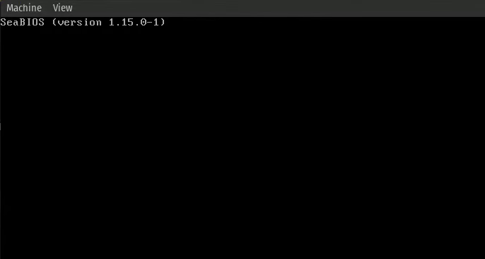

# Debugging Our Operating System

Debugging is a crucial part for a good operating system, and especially on the start of the development when we still don't have good debugging methods, like printing, we need to use other methods.

<figure><figcaption></figcaption></figure>

